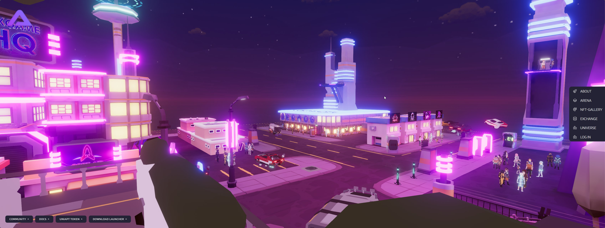

# Analysis of the Project Website and Online Presence

***


The website of UNIAPT serves as the digital gateway to the project, providing comprehensive information, resources, and a user interface that reflects the project's identity and values. A detailed analysis of the website and its online representation involves examining various aspects, including design, content, usability, and functionality.


<figure><figcaption></figcaption></figure>

***

<table><thead><tr><th width="376" align="center">Website Design and Aesthetics</th><th width="372" align="center">Content Quality and Information</th></tr></thead><tbody><tr><td align="center"><mark style="color:green;"><strong>Visual Appeal</strong></mark>: The website features a modern, engaging design that aligns with the futuristic and innovative nature of the UNIAPT project. The use of vibrant colors, dynamic graphics, and interactive elements creates a visually appealing experience.</td><td align="center"><mark style="color:green;"><strong>Introduction and Overview</strong>:</mark> The homepage provides a succinct yet comprehensive introduction to UNIAPT, capturing its essence and inviting visitors to explore further.</td></tr><tr><td align="center"><mark style="color:green;"><strong>Branding Consistency</strong>:</mark> The website's design consistently reflects the UNIAPT brand identity, including logos, color schemes, and thematic elements that resonate with the project's focus on blockchain and meta-universe development.</td><td align="center"><mark style="color:green;"><strong>Project Details</strong>:</mark> Detailed sections on the website elaborate on various aspects of UNIAPT, such as its tools, open-source nature, blockchain integration, and market analysis capabilities.</td></tr><tr><td align="center"><mark style="color:green;"><strong>Navigation and Layout</strong>:</mark> The layout is intuitive and user-friendly, with a well-structured menu that allows easy navigation to different sections of the site. This includes clear categorization of information about the project, its tools, community, and support.</td><td align="center"><mark style="color:green;"><strong>Community and Support</strong>:</mark> There are dedicated sections for community engagement, including forums, FAQs, and contact information, ensuring users have access to support and can connect with other members.</td></tr><tr><td align="center"></td><td align="center"><mark style="color:green;"><strong>Updates and News</strong>:</mark> The website features a regularly updated blog or news section, highlighting recent developments, updates, and events related to the UNIAPT project.</td></tr></tbody></table>

|                                                                                                                       Usability and User Experience                                                                                                                       |                                                                                                            Technical Aspects and Functionality                                                                                                           |
| :-----------------------------------------------------------------------------------------------------------------------------------------------------------------------------------------------------------------------------------------------------------------------: | :------------------------------------------------------------------------------------------------------------------------------------------------------------------------------------------------------------------------------------------------------: |
| <mark style="color:green;">**Loading Speed and Responsiveness**</mark><mark style="color:green;">:</mark> The website loads efficiently with minimal delays, ensuring a smooth user experience. It is also responsive, adapting well to various devices and screen sizes. |                        <mark style="color:green;">**Security Measures**</mark><mark style="color:green;">:</mark> The website employs robust security protocols, evident in secure HTTPS connections and data protection measures.                       |
|         <mark style="color:green;">**Interactive Elements**</mark><mark style="color:green;">:</mark> Interactive features, such as demos of tools, video tutorials, and clickable infographics, enhance the user experience, making it engaging and informative.         |           <mark style="color:green;">**Performance Optimization**</mark><mark style="color:green;">:</mark> It is optimized for performance, with fast loading times and smooth transitions between pages, indicating good backend development.          |
|        <mark style="color:green;">**Accessibility Features**</mark><mark style="color:green;">:</mark> Consideration for accessibility, such as text-to-speech options, alt text for images, and easy-to-read fonts, indicates inclusivity and user-centric design.       | <mark style="color:green;">**SEO and Online Visibility**</mark><mark style="color:green;">:</mark> An analysis of SEO practices suggests effective strategies, with the website ranking well for relevant keywords, indicating strong online visibility. |

<table><thead><tr><th width="444" align="center">Community Engagement and Interactive Features</th><th align="center">Marketing and Promotional Content</th></tr></thead><tbody><tr><td align="center"><mark style="color:green;"><strong>Social Media Integration</strong>:</mark> Links to UNIAPT’s social media channels are prominently displayed, facilitating community engagement.</td><td align="center"><mark style="color:green;"><strong>Marketing Strategy</strong>:</mark> The website showcases a well-thought-out marketing strategy, with clear calls-to-action (CTAs), promotional banners for upcoming events or updates, and incentives for community participation.</td></tr><tr><td align="center"><mark style="color:green;"><strong>Feedback Mechanisms</strong>:</mark> Features like contact forms, surveys, and comment sections enable visitors to provide feedback, fostering a two-way communication channel.</td><td align="center"><mark style="color:green;"><strong>Educational Resources</strong>:</mark> Availability of educational resources, such as detailed documentation, tutorials, and FAQs, assists in promoting the project and educating the audience.</td></tr></tbody></table>

***


UNIAPT's website is a well-designed, information-rich portal that effectively communicates the project's vision, offerings, and value proposition. It balances aesthetic appeal with functionality, providing an engaging user experience while ensuring ease of navigation and access to key information. The website reflects a strong online presence and serves as an essential tool for community engagement, education, and project promotion. The continuous updates and attention to user feedback suggest a commitment to maintaining a dynamic and user-centric online platform.

